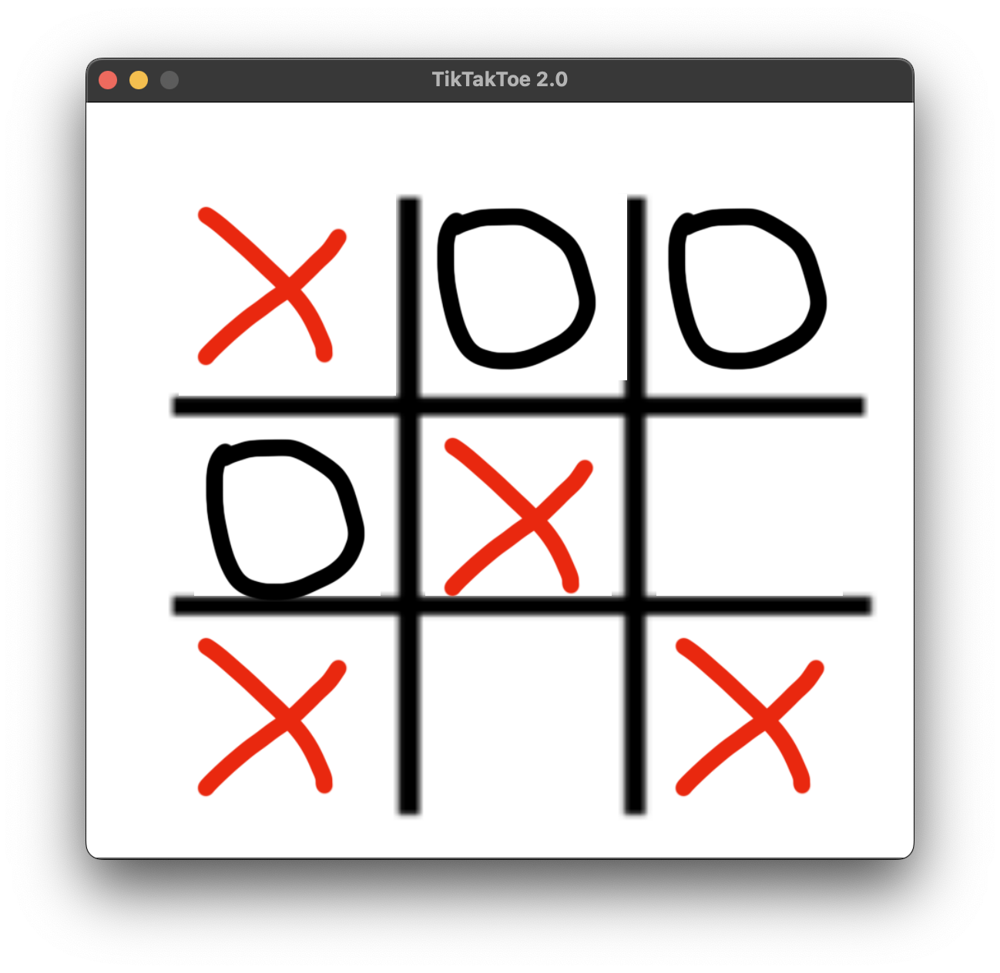

# TikTakToe 2.0
Хрестики-нулики 2.0 на Python

# Можливості та плюси
  - Гра у хрестики-нулики
  - Необмеженна кількість ігор
  - Скасування ходів
  - Відкритий вихідний код. У цьому репозиторії ви і можете його подивитись, та інші розробники можуть писати чіти :)

# Демонстрація ПЗ

